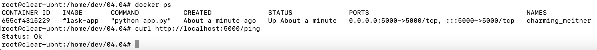
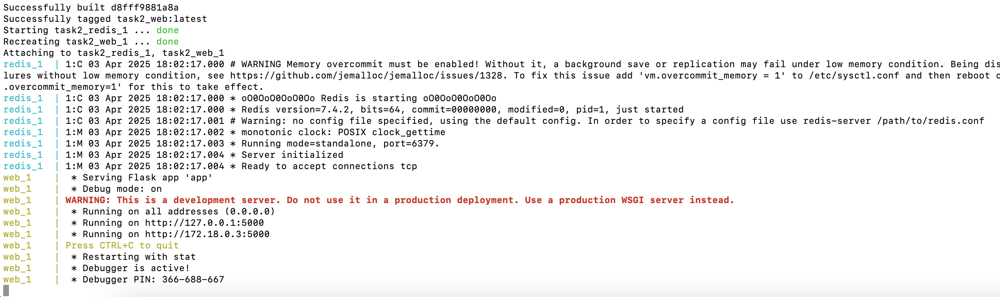
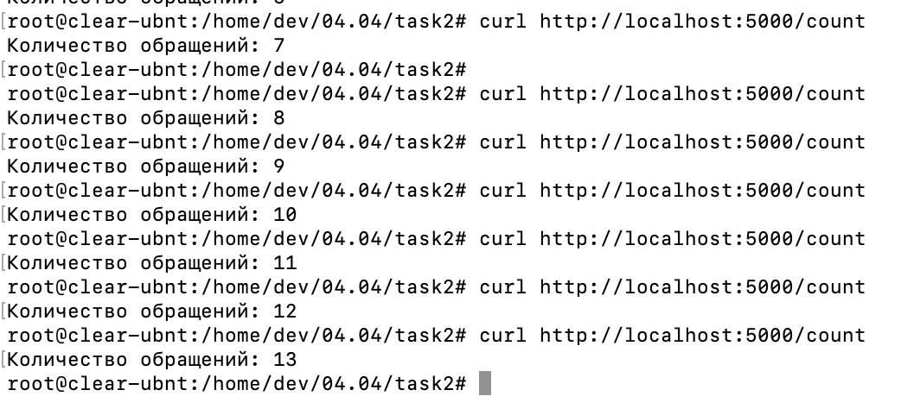
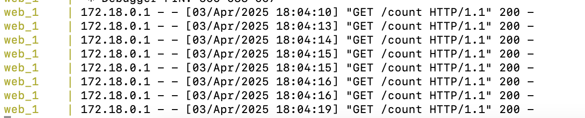

Задание 1: Docker image

Создайте Dockerfile, который:

- Используется python9 как базовый образ.
    
- Копирует локальный файл app.py в контейнер.
    
- Устанавливает зависимости из requirements.txt.
    
- Запускает Flask-приложение при старте контейнера.
    
    Необходимо создать app.py - простое Flask api с 1 эндпоинтом /ping, который возвращает {"status": "ok"}.
    
    Контейнер должен запуститься на порту 5000. Проверка работы контейнера производится путем отправки curl запроса http://localhost:5000/ping

 Задание 2: Docker compose
 
 Создайте docker-compose.yaml, который поднимет 2 контейнера:
 
- Собирает Flask приложение из первой части.
- Redis из образа redis:alpine как кеш.  
    Необходимо обновить app.py, чтобы он использовал Redis.  
    При запросе к /count увеличивал счетчик посещений и возвращал его. Запустите docker-compose и убедитесь, что сервисы работают корректно.

